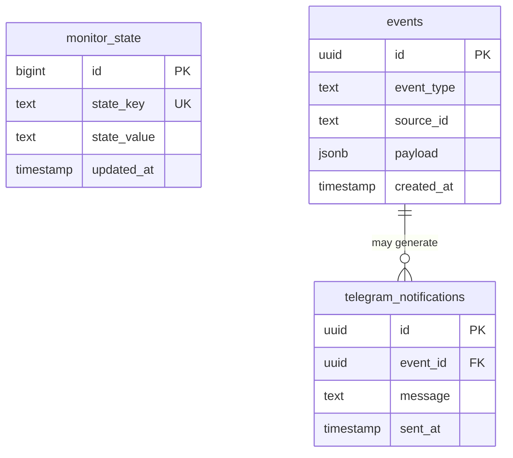
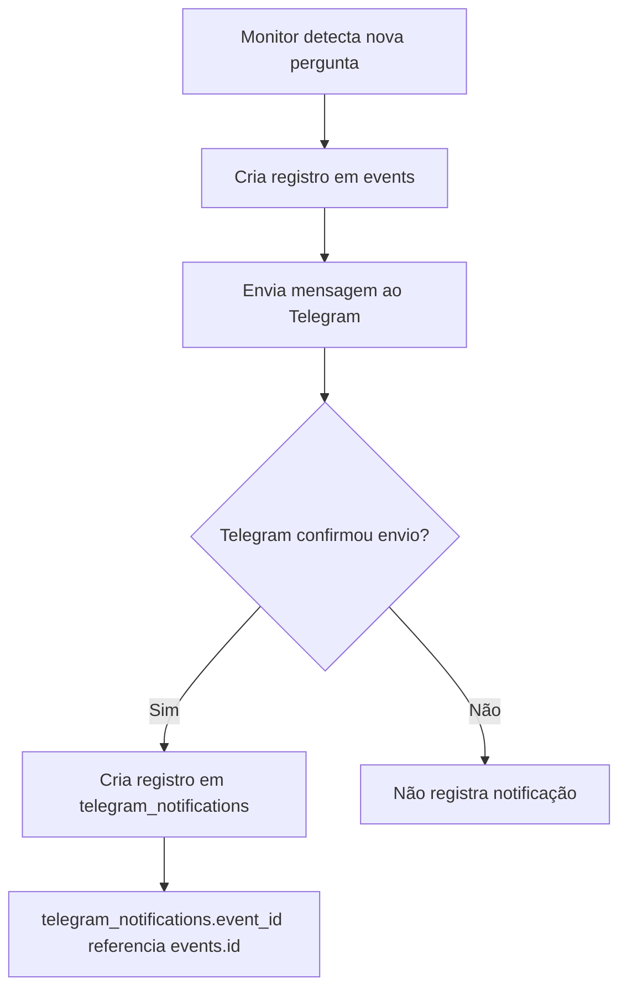

# Database

Este documento descreve a estrutura inicial do banco de dados do **O Corvo Mensageiro** no Supabase.

O banco armazena três grupos principais de dados:

- estado persistente dos monitores;
- histórico de eventos detectados no Mercado Livre;
- auditoria de notificações enviadas ao Telegram.

## Visão Geral



## Tabelas

### monitor_state

Tabela usada para guardar estados persistentes dos monitores.

Ela evita que o backend perca o último item processado quando o servidor reinicia. Por exemplo, o monitor de perguntas salva o último ID de pergunta visto em `last_question_id`.

#### Campos

| Campo | Tipo | Obrigatório | Descrição |
| --- | --- | --- | --- |
| `id` | `bigint identity` | Sim | Identificador interno da linha. |
| `state_key` | `text` | Sim | Chave única do estado salvo. |
| `state_value` | `text` | Sim | Valor persistido para a chave. |
| `updated_at` | `timestamp` | Não | Data da última atualização. |

#### Exemplo de Registro

```json
{
  "id": 1,
  "state_key": "last_question_id",
  "state_value": "13610443430",
  "updated_at": "2026-06-25T18:14:45.034852"
}
```

### events

Tabela usada para armazenar o histórico dos eventos detectados pelo sistema.

Hoje ela registra novas perguntas do Mercado Livre com o tipo `QUESTION_CREATED`, mas a estrutura já está preparada para outros eventos, como pedidos, mensagens e reclamações.

#### Campos

| Campo | Tipo | Obrigatório | Descrição |
| --- | --- | --- | --- |
| `id` | `uuid` | Sim | Identificador único do evento. |
| `event_type` | `text` | Sim | Tipo do evento detectado. |
| `source_id` | `text` | Sim | ID do recurso original no Mercado Livre. |
| `payload` | `jsonb` | Não | Conteúdo bruto ou enriquecido do evento. |
| `created_at` | `timestamp` | Não | Data em que o evento foi registrado. |

#### Índices e Restrições

Existe um índice único em `event_type` + `source_id`:

```sql
create unique index if not exists events_event_type_source_id_unique
  on events (event_type, source_id);
```

Essa restrição impede que a mesma pergunta, pedido, mensagem ou reclamação seja registrada mais de uma vez para o mesmo tipo de evento.

#### Exemplo de Registro

```json
{
  "id": "8f8ec400-0dfc-493e-9ac3-acc3ace61767",
  "event_type": "QUESTION_CREATED",
  "source_id": "13609721483",
  "payload": {
    "id": 13609721483,
    "text": "O produto é entregue pelo Mercado Livre ou por alguma outra transportadora?",
    "status": "UNANSWERED",
    "item_id": "MLB6056960604",
    "seller_id": 2929638654
  },
  "created_at": "2026-06-25T18:32:31.55518"
}
```

### telegram_notifications

Tabela usada para auditar as notificações enviadas ao Telegram.

Uma notificação só deve ser registrada quando o Telegram confirmar o envio com sucesso. Quando a notificação vem de um evento salvo, `event_id` aponta para a tabela `events`.

#### Campos

| Campo | Tipo | Obrigatório | Descrição |
| --- | --- | --- | --- |
| `id` | `uuid` | Sim | Identificador único da notificação. |
| `event_id` | `uuid` | Não | Referência opcional ao evento que originou a notificação. |
| `message` | `text` | Sim | Texto enviado ao Telegram. |
| `sent_at` | `timestamp` | Não | Data em que a notificação foi registrada como enviada. |

#### Exemplo de Registro

```json
{
  "id": "5f5a0936-93a7-48de-9ac8-6cd114f55f4d",
  "event_id": "8f8ec400-0dfc-493e-9ac3-acc3ace61767",
  "message": "❓ Love Eletro: NOVA PERGUNTA\nPergunta: O produto é entregue pelo Mercado Livre ou por alguma outra transportadora?",
  "sent_at": "2026-06-25T18:32:32.101245"
}
```

## Relacionamento de Eventos e Notificações



## Como Recriar as Tabelas no Supabase

As migrations ficam em:

```text
backend/supabase/migrations/
```

Para recriar manualmente pelo painel do Supabase:

1. Abra o projeto no Supabase.
2. Acesse **SQL Editor**.
3. Execute os scripts abaixo na ordem apresentada.

### 1. Criar monitor_state

```sql
create table if not exists monitor_state (
  id bigint generated by default as identity primary key,
  state_key text unique not null,
  state_value text not null,
  updated_at timestamp default now()
);
```

### 2. Criar events

```sql
create table if not exists events (
  id uuid primary key,
  event_type text not null,
  source_id text not null,
  payload jsonb,
  created_at timestamp default now()
);
```

### 3. Criar índice único de events

```sql
create unique index if not exists events_event_type_source_id_unique
  on events (event_type, source_id);
```

### 4. Criar telegram_notifications

```sql
create table if not exists telegram_notifications (
  id uuid primary key,
  event_id uuid references events(id),
  message text not null,
  sent_at timestamp default now()
);
```

## Observações Para Desenvolvimento

- `monitor_state` deve guardar apenas estados pequenos e serializáveis como texto.
- `events.payload` deve preservar o máximo possível do payload original recebido da API externa.
- `telegram_notifications` não deve registrar tentativas com falha, apenas envios confirmados.
- Para evitar duplicidade de eventos, use sempre `event_type` e `source_id` de forma consistente.
- O endpoint `GET /api/events` consulta a tabela `events` com paginação e ordenação por `created_at desc`.
